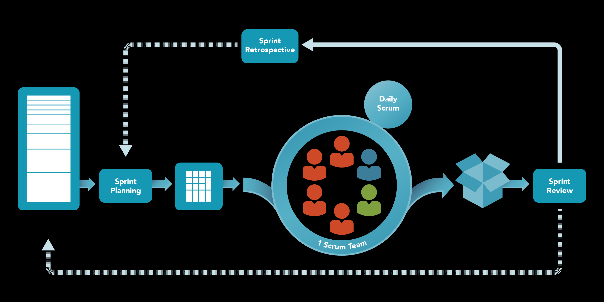

# Agile and Cultural Difference

Welcome to the Wiki introducing Distributed Agile Development Practices. The goal of this wiki is to introduce the main challenges introduced by distributed agile. By presenting the common cultural differences, as well as how it impacts the Scrum methodology, we hope to surface the problems so you can take these into account when working in a distributed setting. First, this wiki will explain what the agile methodology is. The original agile methodology was created to help create better ways of software development. However, as companies are expanding to other countries, the agile methodology also has to work in a distributed setting. With the distance between developers, communication, coordination and control suffer. In this wiki, we will dive into agile development in distributed setting and its challenges. Furthermore, common cultural differences in distributed software development are explained. Lastly, Scrum is explained and the cultural challenges affecting its phases are explained. 

## Agile in distributed settings

Agile is a well-known term in software engineering, but what is it exactly? Based on the article (Abrahamsson et al., 2017), call software development methodology is agile when software development is incremental (small software releases, with rapid cycles), cooperative (customer and developers working constantly together with close communication), straightforward (the method itself is easy to learn and to modify, well documented), and adaptive (able to make last moment changes).

Agile Manifesto also has been set up by 17 developers at The Lodge at Snowbird ski resort in Utah (Beck et al., 2013). This Manifesto includes 4 values for agile and 12 principles. The well-known values are the following: **Individuals and interactions** over processes and tools, **Working software** over comprehensive documentation, **Customer collaboration** over contract negotiation, and **Responding to change** over following a plan. These 4 values are intended to improve a software development process by guiding the development to a better direction and delivering a high-quality, working software that meets consumers' needs.

While lots of companies are adopting agile methodology, globalisation is also taking place in the IT industry. Tight budgets, limited resources, and time constraints have motivated many companies to explore global sourcing (Šmite et al., 2010). As a result, companies could gain more benefits, but also need to face new problems related to communication, coordination, collaboration, etc.

Unfortunately, there is no fixed agile method to apply to the distributed setting as of yet due to compatibility issues (Šmite et al., 2010). We can still learn from additional tips suggested by (Phalnikar et al., 2009).

1. Document appropriately whenever necessary.
2. Customer Proxy should interact and communicate well with both technical and business project members.
3. Adjust work schedules to reduce time-related issues coming from the time differences.
4. Use message boards or Wiki instead of email.

### Challenges in agile development in a distributed setting
Challenges are coming from the distributed environment itself. Distributed settings bring problems such as Strategic issues, Cultural issues, Inadequate communication, Knowledge management, Project and process management issues, technical issues, and Risk Management (Shrivastava & Date, 2010). Temporal distance and Geographical distance are also physical problems that are not easy to be directly solved with the technologies unless the developer moves across the globe. For instance, zero overlapping time can be a problem when organising a meeting or an event that should happen synchronously. It is also hard to feel intimate when the team members are all physically apart. Fortunately, by utilising temporal distance properly, follow-the-sun development can be implemented, so there are not only drawbacks in the distributed environment.

There are also challenges coming from the compatibility between agile and distributed settings (Shrivastava & Date, 2010).

1. Documentation: Offshore organizations favour the detailed requirements or designs that are sent offshore to be constructed while agile teams tend to downplay documentation.
2. Pair programming: This is not possible in a distributed environment.
3. Different working hours: No overlapping working hours can be a problem.
4. Training on teams: It is hard to train new people when it is fully remote. Cultural differences can also make it more difficult.
5. Distribution of work: Work distribution should not take place according to the location.

Besides these issues, there are other challenges such as lack of team cohesion, formal and informal agreement, and so on (Ramesh et al., 2006).

## Common cultural differences in distributed SE development
Globalisation is taking place everywhere, but people from different countries have different work ethics, culture, individual perception, etc. One of the key challenges discovered in the previous section is 'Cultural Diversity'. Cultural Diversity can certainly bring some benefits to the team. The heterogeneous groups have a higher level of collaboration and conflict management, so they tend to achieve consensus of higher quality (Paul et al., 2004). Cultural diversity can also bring creativity, innovation and problem-solving skills to the team (Milewski et al., 2008). However, the cultural difference can also negatively affect the team. Thus, it is crucial to look at what kind of cultural challenges can occur while working in an Agile setting, which is a common methodology used by many companies.

Distributed software engineering comes with the collaboration of people with different cultures and habits. This means that the ability to cover these cultural differences can lead to a better understanding within a team. Hofstede made a distinction between six types of cultural dimensions (Van Solingen, 2022).

* Power distance index: to what level do individuals accept hierarchy and use of powers within the organisation?
* Individualism vs. collectivism: do the employees/individuals in the organisation have a goal together or is it focused on personal goals?
* Masculinity vs. femininity: the level of “toughness” in an organisation and attitude towards sexuality equality
* Uncertainty Avoidance Index (UAI): cultures with a high UAI have a low tolerance for uncertainty, and are risk-averse and vice versa.
* Long-term orientation: to what extent is the focus of the organisation and its employers on the long-term horizon?
* Indulgence: focuses on to what level personal needs and the concept of “enjoying life” is accepted in a culture or organisation (Dafoulas & Macaulay, 2002).

A comparison between the scores on Hofstede's six cultural dimensions of four countries has been made: The Netherlands, The United States, Brazil and China (Hofstede Insights, 2022). As can be seen in the figure below, noticeable differences are that China and Brazil score relatively low on the individualism pillar while the Netherlands and US score high. Based on that information, it can be said that the Chinese and Brazilians see more value in working towards a common goal instead of personal goals. Besides that, China is the only country of the four that scores relatively low on the level of indulgence. In the other three countries, personal needs are more accepted within organisations.

Another general cultural difference is language. While English is the standard language, not everyone speaks it fluently. People may have different interpretations of, for example, written requirements. This can result in the various understanding of the client’s requirements as a development team relies on written or spoken communication (Patel, Lawson-Johnson & Patel, 2009).

From research, it can be concluded that the attitude toward time spent on working and deadlines are opposed to each other. At the start of a project, people from the Middle East will spend time getting to know each other, while people from the US are more focused on the deadline and start working quickly with less focus on getting to know their colleagues (Patel, Lawson-Johnson & Patel, 2009). This influences the outcome of the final product as the team did not understand each other from the beginning and thus leads to complexities in communication and collaboration.

### Mitigation of problems caused by cultural differences related to communication, coordination and control
The socio-technical nature of software development makes interaction complex when culture differs, such as behaviour, beliefs, values and patterns. The paper above contributes twelve practices derived from nineteen different studies to provide awareness and understanding of culture to prevent conflict, and mistrust, to achieve maximum performance with the available expertise. The paper further proposes specific activity patterns per point for teams to implement in their work.

1. “Understand and be aware of cultural differences”, improves communication and coordination by understanding the different backgrounds of members and knowing what behaviour is and isn’t acceptable in different cultures.
2. “Make onsite visits”, as a team-building exercise for improving trust and socialisation. This improves communication.
3. “Standardise skills required for global team members”, a diverse team increases understanding, for example by considering language, age, geography and gender. Developer skills and leadership boost control.
4. “Identify and establish the cultural context of each global team”, understanding cultural differences can be the difference in increased creativity and innovation or dispute and confusion.
5. “Provide cultural training”, to improve awareness and thus improve the other points.
6. “Look out for cultural misunderstanding in requirements”, misinterpretation may cause composing requirements and actual needs to differ. Control of a satisfactory product and communication of needs is improved by looking out for these differences.
7. “Develop and maintain a cultural knowledge base”.
8. “Assign a local manager with the skills needed for a global team”, improves all three c’s. Such a manager can be the connection to enhance communication and coordination, gaining more control over the result.
9. “Offer English language training sessions”, to improve communication.
10. “Plan how to mitigate issues caused by cultural misunderstanding”, planned actions like repositories and distributed reinforcement teams may address potential problems caused by cultural confusion. Common labour practices and team building also mitigate the potential problems.
11. “Prepare for distributed meetings”, document issues beforehand and the results from meetings, and focus on open conversations. These methods improve coordination.
12. “Project managers should take into account cultural differences during group exercises”, and improve control by preventing misunderstandings and delays.

## Scrum phases affected by cultural differences

Agile is a manifesto that is like a compass. One can always adhere to the Agile methodology, by following its principles, no matter the method. One of the agile methods is Scrum. In the previous section <!-- add link to previous section or ref -->, six types of cultural dimensions were mentioned. In this section, the effect of the difficulties from the different cultural dimensions are identified. Specifically, how the different Scrum phases are affected by these differences. 

Scrum is an empirical approach facilitated by rich communication, a collaborative environment and is usually considered effective for co-located projects with small team sizes. It uses a backlog, containing a list of items that need to be implemented (Hossain, 2009). The whole development process consists of sprints which are development cycles. The Sprint consist of Scrum events; in the Sprint planning, the issues that are to be worked in during the sprint are discussed. At the end of each Sprint is the Sprint Review and Sprint Retrospective. During the review, the outcome of the Sprint is inspected and future adaptations are determined. The purpose of the Sprint retrospective is to plan ways to increase quality and effectiveness. Lastly, there are daily scrums during which progress toward the Sprint Goal is inspected and the Sprint Backlog is adapted as necessary, adjusting the upcoming planned work. During each of these cycles, cultural differences between teams or individuals in teams can impact the productivity of the method (Scrum. Org, 2022).

The following cultural dimensions have a great effect on the Scrum process and are discussed in further detail.

### Power distance index <!-- : to what level do individuals accept hierarchy and use of powers within the organisation? -->
<!-- * In certain cultures there is a strict workplace hierarchy. Individuals may have trouble asking follow-up questions to a product owner. This problem can be mitigated by the product owner asking the individuals if they have questions. 
* Daily scrum, sprint planning-->
* In cultures with a large power distance the **product owner** will have more monitoring of work and on the team compared to cultures with a small power distance. Whether the product owner attends meetings may depend on the culture and their power index. 
* If a product owner or manager is attending the more informal meetings or **Daily Scrums**, the team may be affected in their communication due to a large power distance.
* The **Scrum master** is expected to be more obvious in his/her function, in terms of managing the team and initiative, in societies where there is a large power index.
* A **Scrum leader** may be assigned in cultures with a large power distance. Whereas in cultures with a small power distance, leaders and subordinates tend to be more informal and assign tasks among themselves.
* **Sprint teams** in cultures with small power distance have equal roles among members. Cultures with a large power distance can have informal job divisions and informal hierarchies. 
* The **Sprint** is not allowed to be interfered with by anyone outside the Scrum team. However, Scrum team sprints may get affected by someone outside a team, for example, a product owner, due to the large power distance culture that a team has.

<!-- ### Individualism vs. collectivism: do the employees/individuals in the organisation have a goal together or is it focused on personal goals? -->

### Masculinity vs. femininity <!-- : the level of “toughness” in an organisation and attitude towards sexuality equality -->
* People in a feminist society prefer working in smaller groups. Whereas countries in a masculine society prefer working in larger groups. Countries such as Sweden are more feminist. While countries like China are more masculine.
* In masculine cultures it is expected from the **Scrum master** to be decisive and assertive when it comes to decision making.

### Uncertainty Avoidance Index (UAI) <!-- : cultures with a high UAI have a low tolerance for uncertainty, and are risk-averse and vice versa. -->
* Cultures with a strong uncertainty avoidance society perceive higher stress and subjective feeling of anxiety. Thus, people from these cultures have more desire for precision, formalization and time management. This can affect the **Daily Scrum** and other meetings.
* Furthermore, strong uncertainty avoidance cultures see money as money and chase precision. They often prefer to follow the rules. This can affect their attitude towards **Sprint time limitation** and how they manage time in Sprints.
* Weak uncertainty avoidance cultures find making the decision more important than the decision contents. This can be apparent in the behaviour of the **Scrum master**.
* In cultures with strong uncertainty avoidance, people have more inner drive to work hard compared to the weak uncertainty avoidance cultures. Reflecting the team's efforts they put into work and how their relationship between work and leisure.
* Time-boxed meetings, such as **Sprint planning** or **Daily Scrum** may not be as strict in time. They may take longer if the attitude towards time and formalization differ. 

<!--### Long-term orientation: to what extent is the focus of the organisation and its employers on the long-term horizon? -->

<!-- ### Indulgence: focuses on to what level personal needs and the concept of “enjoying life” is accepted in a culture or organisation (Dafoulas & Macaulay, 2002). -->
### Other cultural aspects 

The following cultural differences are commonly present in distributed SE development Scrum events:

| Scrum event | Cultural difference | Effect | Solution|
|-----|---------|--------------------------|-----------------------------|
| Backlog | Misunderstandings of requirements. | In the worst case, the misunderstanding may not have been noticed until the demo. | Product owners have to ask follow-up questions. |
| Daily Scrum   | During the daily scrum meetings, specifically at the beginning of the development, people from Asian cultures take time to open up and tell about their tasks and impediments. Whereas people from Western cultures are more open (Paasivara, 2008). | This can result in short daily meetings, that take only a couple of minutes | Encourage the team to open up and communicate outside of the meetings. |
| Sprint planning | Cultural and language differences can cause silence or misunderstandings among some participants. | People from Asian cultures tend to not ask enough. Whereas people from Western cultures see Sprint planning as an opportunity to transfer business-related knowledge. Furthermore, some cultures tend to speak more directly whereas other cultures prefer to have more small talk (Paasivara, 2013) | Give a possibility for team members from all sites to participate to ask for clarifications, to understand tasks, and to commit to common goals. |

**References**  
Dafoulas, G., & Macaulay, L. (2002). Investigating cultural differences in virtual software teams. The Electronic Journal of Information Systems in Developing Countries, 7(1), 1-14.  

Patel, D., Lawson-Johnson, C., & Patel, S. (2009, August). The effect of cultural differences on software development. In 5th Annual International Conference on Computing and ICT Research (ICCIR) 2009 (pp. 250-263).  

Van Solingen, R. (2022). GSE101x - Cultural Differences [PowerPoint slides]. Brightspace. https://brightspace.tudelft.nl/d2l/le/content/400588/viewContent/2421271/View  

Abrahamsson, Pekka & Salo, Outi & Ronkainen, Jussi & Warsta, Juhani. (2002). Agile Software Development Methods: Review and Analysis. Proc. Espoo 2002. 3-107. 

Marinho, M., Luna, A., Beecham, S. (2018). Global Software Development: Practices for Cultural Differences. In: , et al. Product-Focused Software Process Improvement. PROFES 2018. Lecture Notes in Computer Science(), vol 11271. Springer, Cham. https://doi-org.tudelft.idm.oclc.org/10.1007/978-3-030-03673-7_22

Šmite, D., Moe, N.B., Ågerfalk, P.J. (2010). Fundamentals of Agile Distributed Software Development. In: Šmite, D., Moe, N., Ågerfalk, P. (eds) Agility Across Time and Space. Springer, Berlin, Heidelberg. https://doi.org/10.1007/978-3-642-12442-6_1

Phalnikar, R., Deshpande, V.S., & Joshi, S.D. (2009). Applying Agile Principles for Distributed Software Development. 2009 International Conference on Advanced Computer Control, 535-539.

Shrivastava, S.V., & Date, H. (2010). Distributed Agile Software Development: A Review. ArXiv, abs/1006.1955.

Ramesh, B., Cao, L., Mohan, K., & Xu, P. (2006). Can distributed software development be agile? Commun. ACM, 49, 41-46.

Paasivaara, M., Durasiewicz, S., & Lassenius, C. (2008). Using scrum in a globally distributed project: A case study. Software Process: Improvement and Practice, 13(6), 527–544. https://doi.org/10.1002/spip.402

Hofstede Insights. (2021, June 22). Compare countries. Retrieved May 29, 2022, from https://www.hofstede-insights.com/product/compare-countries/

<!-- Paasivaara, M., Durasiewicz, S., & Lassenius, C. (2009). Using Scrum in Distributed Agile Development: A Multiple Case Study. 2009 Fourth IEEE International Conference on Global Software Engineering, 195–204. https://doi.org/10.1109/ICGSE.2009.27 -->

Paasivaara, M., Lassenius, C., Damian, D., Räty, P., & Schröter, A. (2013). Teaching students global software engineering skills using distributed Scrum. 2013 35th International Conference on Software Engineering (ICSE), 1128–1137. https://doi.org/10.1109/ICSE.2013.6606664

The Scrum Guide. (2020). Scrum.Org. Retrieved from https://www.scrum.org/resources/scrum-guide

Paul, S., Samarah, I., Seetharaman, P., & Mykytyn, P. (2004). An Empirical Investigation of Collaborative Conflict Management Style in Group Support System-Based Global Virtual Teams. Journal of Management Information Systems, 21, 185 - 222.

Milewski, A.E., Tremaine, M.M., Egan, R., Zhang, S., Köbler, F., & O'Sullivan, P. (2008). Guidelines for Effective Bridging in Global Software Engineering. 2008 IEEE International Conference on Global Software Engineering, 23-32.

Hossain, E., Babar, M. A., & Paik, H. (2009). Using scrum in global software development: A systematic literature review. 2009 Fourth IEEE International Conference on Global Software Engineering, 175–184. https://doi.org/10.1109/ICGSE.2009.25

Zhao, C. (2015). Impact of national culture dimensions on scrum implementations. Undefined. https://www.semanticscholar.org/paper/Impact-of-National-Culture-Dimensions-on-Scrum-Zhao/44ff6e3d9ca1c36b099bb34dfff8a73015a7090a
Beck, K.L., Beedle, M.A., Bennekum, A.V., Cockburn, A., Cunningham, W., Fowler, M., Grenning, J., Highsmith, J., Hunt, A., Jeffries, R., Kern, J., Marick, B., Martin, R.C., Mellor, S.J., Schwaber, K., Sutherland, J., & Thomas, D.A. (2013). Manifesto for Agile Software Development.
